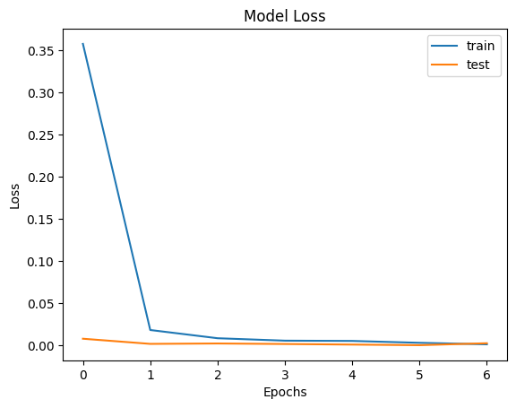
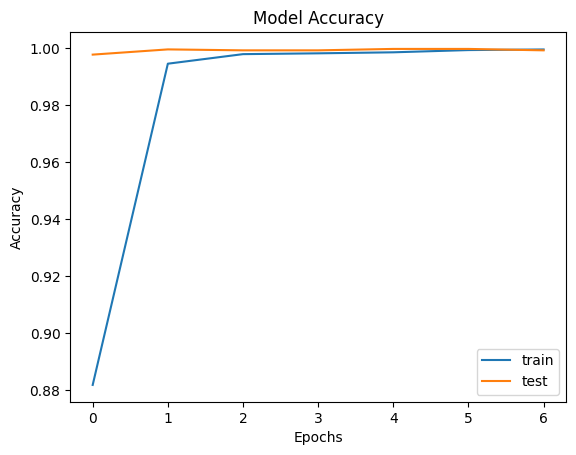

# Hand Gesture Recognition using Convolutional Neural Network (CNN)

This Python script implements a Convolutional Neural Network (CNN) for recognizing hand gestures from images. It uses the LeapGestRecog dataset containing grayscale images of hand gestures.

## Requirements
- Python 3.x
- Required Libraries: `keras`, `matplotlib`, `opencv-python`, `numpy`, `scikit-learn`, `seaborn`, `tensorflow`

## How to Use
1. Mount Google Drive to access the dataset.
2. Unzip the dataset file provided in the Google Drive.
3. Run the script.

## Description
- The script imports necessary libraries such as `keras`, `matplotlib`, `opencv-python`, `numpy`, `scikit-learn`, `seaborn`, and `tensorflow`.
- It loads the hand gesture images from the dataset directory and preprocesses them.
- The images are resized to a fixed size and normalized.
- The dataset is split into training and testing sets.
- A CNN model is constructed using Keras with multiple convolutional and pooling layers followed by dense layers.
- The model is compiled and trained using the training data.
- Loss and accuracy plots are generated to visualize the training progress.
- Finally, the model is evaluated on the test data and a confusion matrix is plotted to analyze the performance.

## Output
The script generates two plots:
1. Model Loss: Shows the loss during training on both training and test sets.
2. Model Accuracy: Shows the accuracy during training on both training and test sets.

Additionally, it prints the test accuracy of the model and displays a heatmap of the confusion matrix, which provides insights into the model's performance in recognizing different hand gestures.

## Author
[Your Name]

## Acknowledgments
- The dataset used in this script is obtained from [source link].
- Inspiration for this script is derived from [source link].
